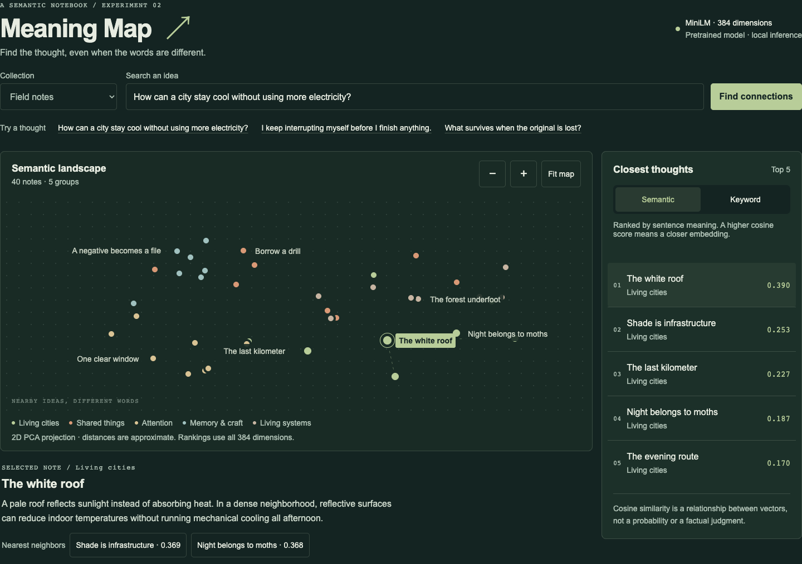

# Meaning Map

A working semantic notebook. Search for an idea, compare semantic and literal word rankings, select notes in a map, follow related thoughts, and add your own text. The two original collections contain **80 notes**: Field notes and Studio notebook, 40 each.



## Run

Requires Node 22 or newer.

```sh
npm ci
npm run dev
```

The development server uses `http://127.0.0.1:5182`. Production verification uses a separate local server on port 5282 with the same-origin CSP described below.

```sh
npm run build
npm test
npm run test:browser
npm run capture
```

`test:browser` starts the production server when needed. `capture` also starts it when needed and writes two screenshots from the actual UI. Build first. The source of both standalone and embedded experiences is `src/index.js`.

## What is actually learned

The sentence encoder is **pretrained**, not trained by this project. It is the Apache-2.0-licensed [Xenova/all-MiniLM-L6-v2](https://huggingface.co/Xenova/all-MiniLM-L6-v2) ONNX conversion of [sentence-transformers/all-MiniLM-L6-v2](https://huggingface.co/sentence-transformers/all-MiniLM-L6-v2), pinned to revision `751bff37182d3f1213fa05d7196b954e230abad9`.

This project writes original notes and generates real 384-dimensional sentence embeddings from their titles and bodies. It uses q8 inference, attention-aware mean pooling, and L2 normalization through [Transformers.js](https://huggingface.co/docs/transformers.js/v3.8.1/api/pipelines). Group labels are authored categories used for color; they are not model-generated clusters and are excluded from embedding input.

Semantic search compares the full query vector with each note using cosine similarity. The comparison tab is an explicitly labeled literal baseline: the fraction of unique query terms found in a note's title or text, after common words are removed. It does not stem words and is not AI.

The map uses deterministic principal component analysis (PCA), implemented with a centered Gram matrix and power iteration. It shows the two leading components. These axes have no assigned conceptual meaning, and two dimensions necessarily discard information. All ranking and nearest-neighbor links use the full 384 dimensions, not map distances. Labels are collision-checked and limited at small widths.

### Reproduce embeddings and evaluation

```sh
node scripts/fetch-model.mjs       # optional: restore pinned official model files
node scripts/prepare-runtime.mjs   # restore official runtime from npm dependencies
npm run prepare:data
npm run evaluate
```

The included model files make data generation work without a Hugging Face request. `prepare:data` runs the same q8 encoder through ONNX Runtime Node and writes `src/data/embeddings.json`. Stored components are rounded to seven decimal places (at most 0.00000005 component error) to reduce the optional JavaScript payload; projection is recomputed from those stored vectors. Fresh browser queries use full runtime float32 output. Tests verify normalization, dimensions, ranking, and projection parity.

`evaluate` embeds 16 human-labeled paraphrase queries absent from the preset examples, and records every query, relevance label, first relevant rank, top three predictions, and score in `examples/retrieval-evaluation.json`. There is no model fitting or fine-tuning in either script. This is a small authored diagnostic set, not an independent or broad benchmark.

| Retrieval method | Hit@1 | Hit@3 | Mean reciprocal rank |
| --- | ---: | ---: | ---: |
| MiniLM cosine | 81.25% (13/16) | 93.75% (15/16) | 0.8795 |
| Literal term overlap | 50.00% (8/16) | 62.50% (10/16) | 0.6038 |

Preset examples were chosen to make useful connections visible; evaluation probes remain separate. Failure cases are included in the JSON report.

## Local inference and limits

No model or runtime is requested on initial mount or when switching prepared examples. Fresh keyword searches also work without a model. A fresh semantic query, adding/importing notes, or clicking **Load local model** explicitly starts the worker and requests same-origin assets. The first load transfers approximately 35.7 MB including the model, tokenizer, JavaScript, and WASM runtime. The browser can cache these assets where supported.

The official Transformers.js 3.8.1 browser bundle is self-hosted unchanged. Its ONNX backend uses a single WASM thread in a dedicated module worker. No SharedArrayBuffer, COOP/COEP, WebGPU, server inference, API key, or external runtime CDN is required. User text is passed to the local worker and never sent in a network request. No model code runs on the interface thread.

The npm Transformers.js package is a development dependency for regenerating embeddings and running the evaluation scripts. Hosts importing this experiment use the checked-in browser runtime, so they do not install the native Node inference dependencies.

A maximum of 100 notes bounds computation. Each note has a 100-character title, 1,800-character body, and 40-character group. Queries are capped at 600 characters. Tokenization truncates long input to the model's configured 512-token limit. English short paragraphs work best; similarity can miss negation, nuance, names, or facts, and can reflect the encoder's biases. Scores are not confidence or truthfulness estimates.

Cancellation terminates the worker, including model loading. A separate operation epoch protects async file reads and multi-stage add/import operations; late completions cannot replace a newer request. Hidden/offscreen work is cancelled. Disposal releases listeners, observers, pointer capture, and the worker. There is no continuous animation or computation when idle.

## Keyboard, mobile, and collection files

- Use Tab to reach the selected map dot. Arrow keys navigate geometrically to another note. Enter/Space selects it.
- With the map itself focused, arrows pan; plus/minus zoom. Buttons provide touch alternatives and **Fit map** restores the overview. Desktop mouse dragging also pans; mobile page scrolling remains available.
- Ranked results and nearest-neighbor links are ordinary labeled buttons. Status/errors use a live region; inputs have labels and visible focus.
- **Your collection** contains add, import, export, and reset actions. Added notes live in this tab only. Export before navigating away.
- JSON export contains versioned plain text, not opaque model vectors. Import validates a maximum 500 KB file with 1–100 notes, then regenerates embeddings before replacing the active collection. Invalid data leaves existing work intact. HTML-like text is rendered literally via `textContent`.

Portable schema:

```json
{
  "version": 1,
  "title": "My notebook",
  "notes": [
    { "id": "note-1", "title": "A thought", "text": "The note body.", "group": "Ideas" }
  ]
}
```

## Embed in the portfolio

```js
import { mountExperiment, metadata } from '@zachshotamartin/meaning-map';
import '@zachshotamartin/meaning-map/style.css';

const instance = mountExperiment(container, {
  assetBase: '/assets/meaning-map/',
  embedded: true,
});
// On unmount:
instance.dispose();
```

The function returns `{ dispose() }` synchronously and owns only its DOM subtree. `embedded: true` omits the standalone title/header; the parent can provide its own title. `metadata.instructions` and `metadata.limitations` are arrays of strings, and `metadata.technique` is a string. CSS is scoped below `.meaning-map` and inherits the host font.

Copy **all contents of `public/`** under the `assetBase` path. Default standalone assetBase resolves `./` against the document base URL. Model paths contain their immutable upstream revision; runtime paths contain their package version. Asset SHA-256 hashes and byte sizes are in `public/models/MANIFEST.json` and `public/runtime/MANIFEST.json`. There are no remote fallbacks.

Required production capabilities:

```text
script-src 'self' 'wasm-unsafe-eval'
connect-src 'self'
worker-src 'self' blob:
```

The host must serve `.mjs` as JavaScript, `.wasm` as `application/wasm`, and permit the tool's dynamic style properties (the included test server uses `style-src 'self' 'unsafe-inline'`). No general JavaScript `unsafe-eval`, inline scripts, or third-party connections are needed. Vite bundles the small module worker; the official model runtime is loaded from `assetBase` only on demand.

## Verification and licensing

Node tests cover embedding math, exact word ranking, deterministic PCA, genuine cached vector shape/norm/parity, and import validation. Browser tests use actual local model assets with the production CSP and cover arbitrary fresh queries, a newly added note found semantically, model errors/retry/cancel, delayed requests/file reads, safe markup import, JSON export, keyboard interaction, and 390px layout. Tests do not mock successful embeddings.

The authored implementation and notes are MIT licensed. The pretrained model and Transformers.js are Apache-2.0; ONNX Runtime is MIT with included third-party notices. See `THIRD_PARTY_NOTICES.md` and the license files under `public/`.
